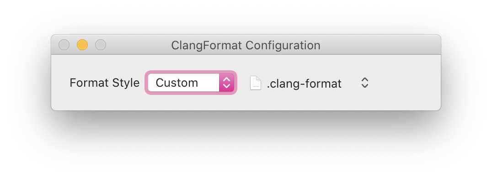
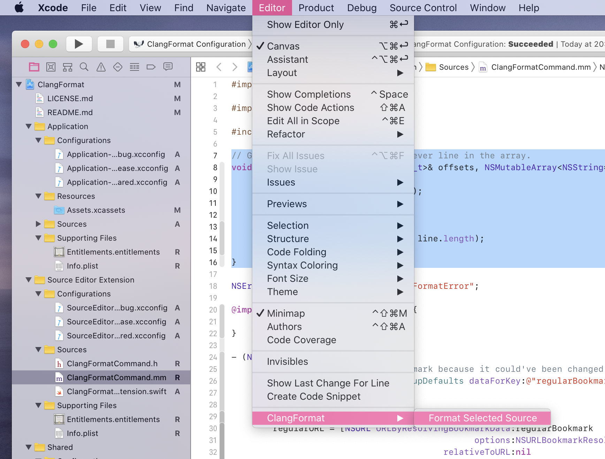
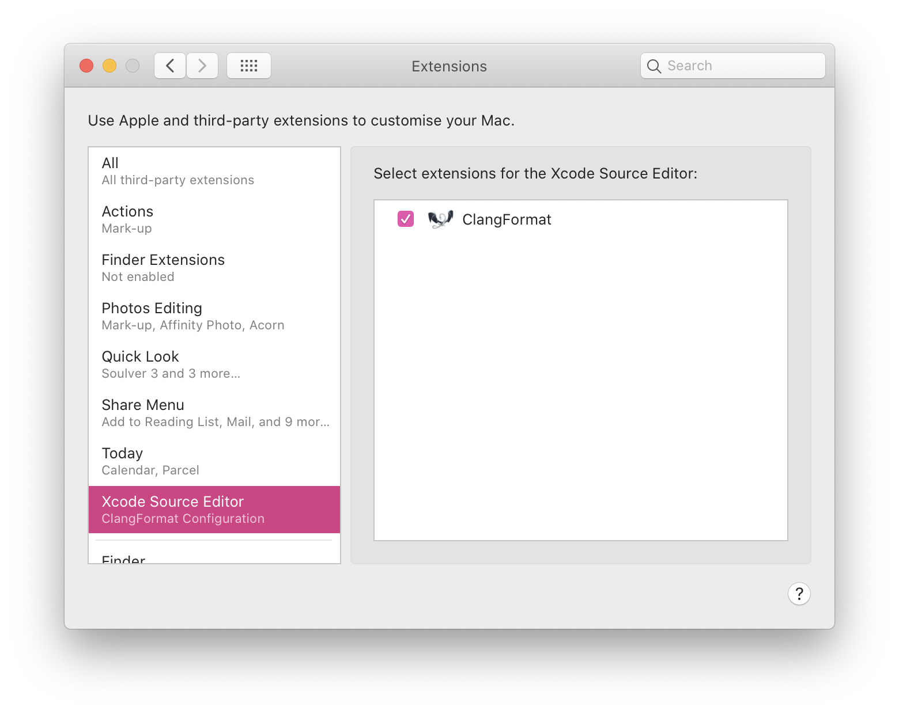
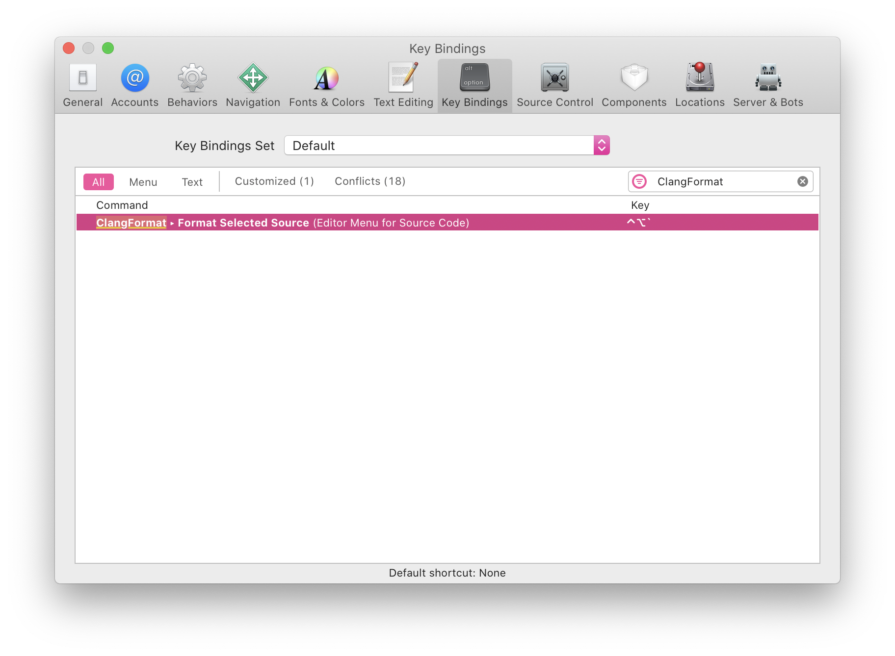

# ClangFormat for Xcode

### [Download](https://github.com/tonyarnold/ClangFormatXcode/releases/latest)

This Xcode Source Editor Extension uses Clang's `libclangFormat` library to format code according to a user-provided `.clang-format` file, or one of the included styles. It was forked from [MapBox's brilliant original project](https://github.com/mapbox/XcodeClangFormat) and modified to suit my own purposes.

Open the app, select a predefined style, or open the `.clang-format` file from your project:

Then, use the <kbd>Format Source Code</kbd> command in Xcode's <kbd>Editor</kbd> menu:

Due to sandboxing restrictions, this extension behaves slightly differently to the command line `clang-format` command: It will always use the style selected in the configuration app, and will not use the nearest `.clang-format` file on disk.

## Installing

Download the binary release, or [build it yourself](#building), then open the app. Then,

Then, go to *System Preferences* → *Extensions*, and make sure that **ClangFormat** in the *Xcode Source Editor* section is checked:

## Setting a key binding

To define a key binding, open *Xcode's Preferences*, click on *Key Bindings*, and filter for `ClangFormat`. Once you have found the menu name, define a key of your liking to trigger the formatting.

## Building

To build ClangFormat, run `./configure` on the command line, then build the "ClangFormat Configuration" scheme in the included Xcode project.

## FAQ

##### Why aren't you just using the `.clang-format` file in the file's parent folder?

Xcode source editor extensions have very limited access to your system - the don't have access to the file system, only to the text in the current editor when you run the command. They also don't get to know the file name of the file to be changed, so there's not enough information available for this extension to know where to load the correct file from.

##### Could you please add “Format on Save”?

Xcode source editor extensions don't allow this; the only thing you can do is return the altered source code.

##### When compiling, I'm seeing the error `'clang/Format/Format.h' file not found`

Ensure that you've run `./configure` in the project directory before trying to build the project from within Xcode. This script downloads and decompresses the precompiled libraries and headers from llvm.org that are required for building the project.
